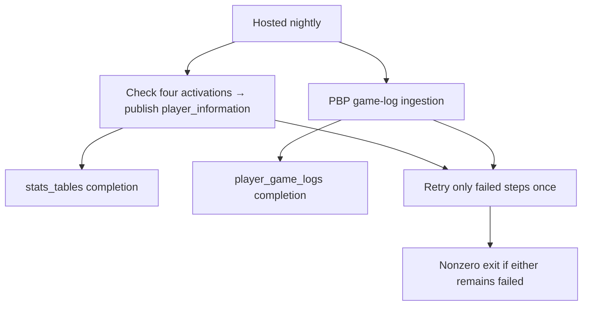

## Change

The hosted nightly refreshed game logs but never published the remaining player metadata. Keep `python scripts/nightly_refresh.py --hosted-only` and add metadata publication through the existing activation-aware `DataService.update_all_data` path. Metadata fails closed unless all four replacement streams are active; hosted providers cannot contact NBA Stats.

The two steps run independently. A failed step preserves its previous data and completion; successful steps are not rerun. `stats_tables` describes the remaining legacy metadata refresh, while residential publication health stays separate. Legacy six-step execution is unchanged.

Closes #273
Part of crf04/statsplus#46

## Verification

Final backend revision: `15a9e7139c3dc7677ce0b3698231c266cdbfd4e4`. Frontend: `2f92cba52430458822c7ac664a9598409b51cc80`. Coordination: `54a4cb6fcb78b29d8ccc65c9859d54f50ee30ca5`.

Live QA ran on application contents subsequently committed as `03b49ca223ac81900ce5d405769e84a7d143e5b5`; final commit changes only the regression test. Final review snapshot differs from final commit only by one blank line between tests; `git diff --ignore-blank-lines` is empty. See [revision evidence](revision-evidence.json).

| Check | Result | Revisions, command, and evidence |
| --- | --- | --- |
| Backend completion gate | Passed | `./scripts/check.sh`: 4,908 passed, 62 subtests, 85.00% coverage; migration application and idempotence; demo DB valid. |
| Coordination gate | Passed | `STATSPLUS_BACKEND_ROOT=<implementation> STATSPLUS_FRONTEND_ROOT=<frontend> python3 scripts/check.py`; 13 endpoint contracts and catalogue mirrors. |
| Independent review | Passed after correction | Work-account `gpt-6-astra`, high effort, fresh Standards and Spec contexts with exact issues and full diff. Round 1: Standards passed, Spec found one missing real-ingestion regression guarantee. DeepSeek fixed it in the same session. Round 2: both axes passed; 3 targeted mutants killed per axis, zero survivors. The previously surviving disconnected-PBP mutant now fails. |
| Isolated PostgreSQL hosted job | Passed | Nine scenarios via `qa-nightly.py`: both completions, each disabled prerequisite, unreadable activation, rollback after swap, independent PBP failure, and real PBP recovery of game `0022501174` (21 rows). 530 metadata rows published. Residential tables/pointers unchanged; zero NBA adapter construction. |
| QA authenticated browser transport | Passed | `control-statsplus.mjs --environment qa --backend <implementation> --frontend <frontend> < game-logs.jsonl`; populated LeBron game logs, HTTP 200, phone reload. |
| Production read-only compatibility | Passed for game-log data | Same journey with `--environment production`; actual Firebase auth and Railway API, desktop/phone evidence. Existing phone overflow check failed on the unchanged frontend and is outside this backend change. |
| Scheduled execution of the new revision | Untested; rollout acceptance pending | This PR does not deploy or change the schedule. Parent #46 stays open through scheduled production acceptance. |

QA uses frozen sports snapshot `3fe69266e135d9ed9e6f671d01e7034c7d529a6ee3a9fa6395851b003ee222f5`. CLI verification extends catalog freshness windows only in the disposable QA process and removes one local game's rows to trigger a real PBP fetch. The no-new-game run follows existing ingestion semantics: zero games processed while its own completion advances. All owned QA databases, browser profiles, and services were cleaned up.

### Production baseline and rollout

Read-only observations on 2026-09-14 UTC: nightly deployment `ecc8cda9-f4e8-43ab-bf16-27ec0cc63c14` runs backend `ce9c7e33eab4de80ec1f5cddfd5145456a9e1851`, command `python scripts/nightly_refresh.py --hosted-only`, schedule `0 10 * * *`, next run `2026-09-14T10:00:00Z`. All four required replacement streams are enabled. `stats_tables` has no completion row; game logs have a complete 26,649-row season publication last retrieved `2026-09-11T10:00:57.172687Z`. These are baseline facts, not acceptance of undeployed code.

After merge/deploy, retain the command and schedule, observe an actual scheduled success, and record metadata completion, game-log completion, and residential publication health separately on parent #46. If acceptance fails, roll back to `ce9c7e33eab4de80ec1f5cddfd5145456a9e1851`, restoring the prior game-log-only hosted behavior.

## Artifacts

- [CLI QA scenarios and before/after facts](qa-nightly.json), [executed verification script](qa-nightly.py), [plan](verification-plan.md).
- [QA browser manifest](qa-browser-evidence/manifest.json), [executed journey](qa-browser-evidence/journey.jsonl), [desktop](qa-browser-evidence/game-logs-desktop.png), [phone](qa-browser-evidence/game-logs-phone.png), [video](qa-browser-evidence/video/).
- [Production browser manifest](production-browser-evidence/manifest.json), [executed journey](production-browser-evidence/journey.jsonl), [desktop](production-browser-evidence/game-logs-desktop.png), [phone](production-browser-evidence/game-logs-phone.png), [video](production-browser-evidence/video/).
- [Preexisting production phone overflow failure](production-overflow-session.json).
- [Production deployment/schedule baseline](production-service-baseline.json), [separate activation, publication pointers, and completion facts](production-data-baseline.json).
- [Final Standards review](review-2-standards-final.md), [final Spec review](review-2-spec-final.md), and their [Standards](review-2-standards-mutations.md) / [Spec](review-2-spec-mutations.md) mutation ledgers.
- [Full backend gate](backend-gate-final.log), [coordination gate](coordination-gate.log).

The CLI QA snapshot and browser QA were separate disposable databases. Production was read-only throughout; no deployment, manual job execution, schedule change, activation change, or rollback was performed. Phone data checks pass, while the existing full-page screenshot shows horizontal overflow from the unchanged comparison/table surface. Screenshots establish displayed state; recorded reloads and network assertions establish the tested browser interaction.
